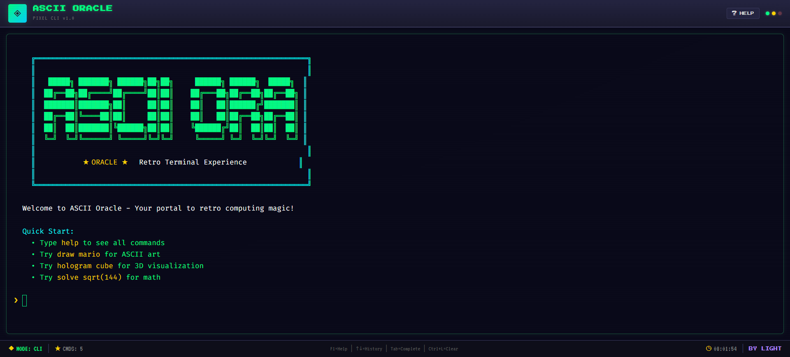
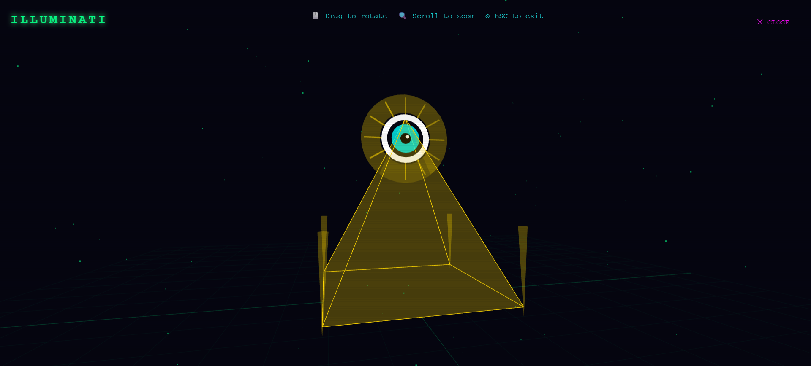
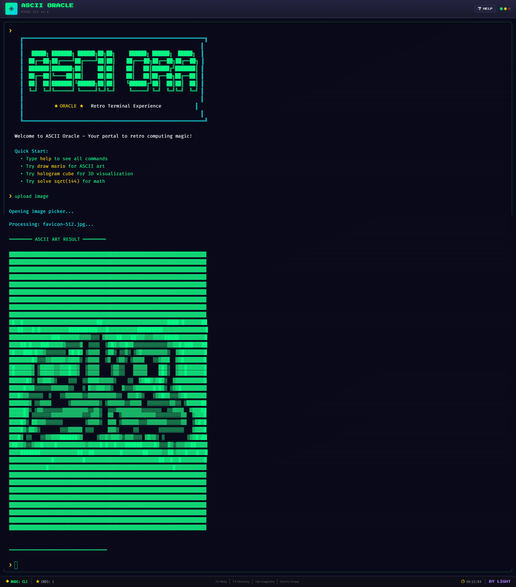

# ASCII Oracle Version 1

> Interactive terminal application combining ASCII art, image processing, 3D visualizations, and computational tools.

**[Live Demo](https://inspiring-haupia-ded8c2.netlify.app/)**

---

## Overview

A full-stack web application featuring:

- **ASCII Art Engine** - 20+ designs with animation support
- **Media Processing** - Image/video to ASCII conversion using Sharp and FFmpeg
- **3D Visualizations** - WebGL-powered holograms via Three.js
- **Computational Tools** - Math solver (calculus, equations), physics/chemistry calculators
- **AI Integration** - Optional Gemini API for intelligent search

## Tech Stack

**Frontend:** React • TypeScript • Vite • xterm.js • Three.js • Tailwind CSS

**Backend:** Node.js • Express • Sharp • FFmpeg

**APIs:** Google Gemini (optional)

## Screenshots

<div align="center">


_Command-line interface with syntax highlighting_


_Real-time 3D text visualization_


_Live image processing and ASCII conversion_

</div>

## Quick Start

```bash
# Clone and install
git clone https://github.com/Sudip-Shrestha0x0/ASCII-Oracle-Version-1.git
cd ASCII-Oracle-Version-1

# Install node modules
npm run install:all

# Optional: Install Python dependencies for math solver
pip install sympy numpy scipy

# Run development server
npm run dev
```

Visit `http://localhost:5173`

## Important: Backend Hosting Note

> **The [live demo](https://inspiring-haupia-ded8c2.netlify.app/) currently hosts only the frontend.** As a frontend developer applying for frontend positions, I've chosen to showcase the client-side implementation.

**Upload Image/Video Features:**

- The file picker and UI are fully functional on the live demo
- The actual image/video to ASCII conversion requires the backend server to be running
- Screenshots show this feature working on my local development server
- To use these features, you'll need to run both frontend and backend locally (see Quick Start)

**Why backend is not hosted:**

- Avoided free hosting options that would require 24/7 server maintenance
- Backend code is complete and functional (uses Sharp for images, FFmpeg for videos)
- All other features work without backend dependency

All backend logic for media processing is implemented and tested locally. Feel free to clone and run the full stack to see the complete functionality.

## Key Features

| Command                 | Description                                 |
| ----------------------- | ------------------------------------------- |
| `draw <name>`           | Render ASCII art (mario, heart, star, etc.) |
| `upload image`          | Convert images to ASCII                     |
| `hologram cube`         | Launch 3D rotating cube                     |
| `solve integral x^2 dx` | Solve calculus problems                     |
| `physics projectile`    | Physics calculations                        |

Type `help` or `HELP` for full command list.

## Architecture

```
ascii-oracle/
├── frontend/          React SPA with xterm.js terminal
│   ├── components/    Terminal, HologramViewer, UI
│   └── utils/         Command parser, ASCII library
└── backend/           Express API server
    ├── routes/        REST endpoints
    └── services/      Image processing, AI integration
```

## License

MIT
